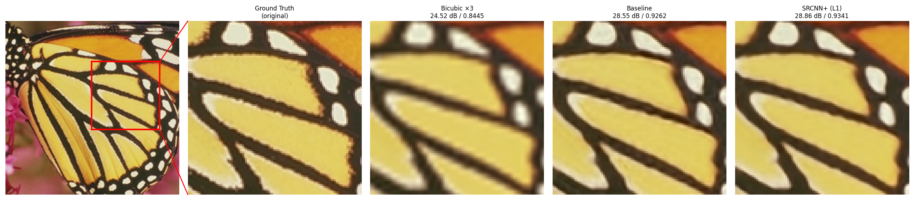
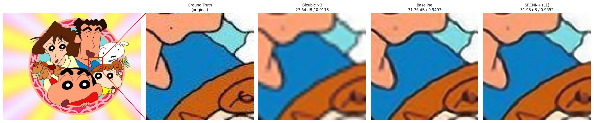
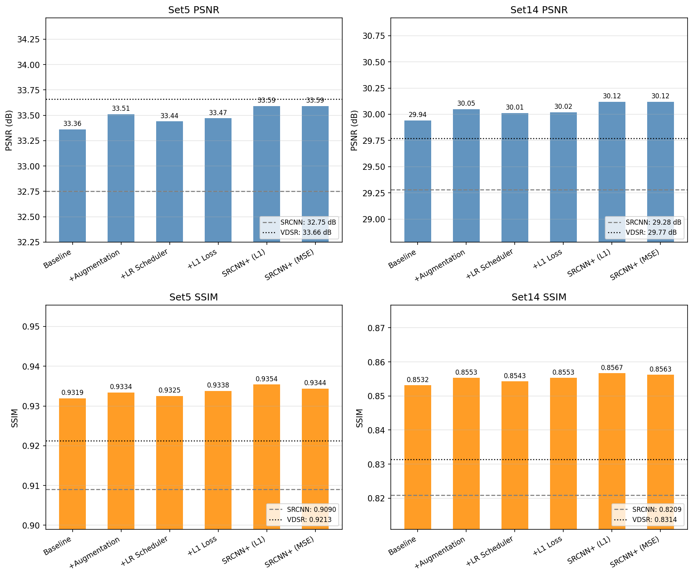

# SRCNN+: Training Improvements for Single Image Super-Resolution

PyTorch re-implementation of [Image Super-Resolution Using Deep Convolutional Networks](https://arxiv.org/abs/1501.00092) (Dong et al., TPAMI 2016), extended with four improvements: data augmentation, learning rate scheduling, L1 loss, and residual learning.

## Results (Set5, border crop = scale pixels)

| Scale | SRCNN paper | Baseline (ours) | SRCNN+ (L1) | Gain |
|-------|-------------|-----------------|-----------------|------|
| ×2 | 36.66 / 0.9542 | 36.69 / 0.9594 | 37.00 / 0.9612 | +0.34 dB |
| ×3 | 32.75 / 0.9090 | 33.36 / 0.9319 | 33.59 / 0.9354 | +0.84 dB |
| ×4 | 30.49 / 0.8628 | 30.33 / 0.8717 | 30.56 / 0.8778 | +0.07 dB |

*Format: PSNR (dB) / SSIM. Evaluation protocol follows VDSR (Kim et al., CVPR 2016).*

### Visual comparison (×3)

**Butterfly** (natural texture):



**Cartoon** (synthetic sharp edges):



### Ablation study (×3, Set5)



---

## Requirements

- Python 3.8+
- See `requirements.txt` for all dependencies

```bash
pip install -r requirements.txt
```

If using a virtual environment:

```bash
source .venv/Scripts/activate     # Git Bash
.venv\Scripts\activate.bat        # Windows CMD
.venv\Scripts\Activate.ps1        # PowerShell
```

> **Windows:** always pass `--num-workers 0` to any script that uses a DataLoader.

---

## Full pipeline: reproduce all experiments

### Step 1 - Prepare datasets

Place your training images in `data/Train/` and test images in `data/Test/Set5/` and `data/Test/Set14/`. Then run:

```bash
python download_dataset.py
```

This script (for each scale x2, x3, x4):
1. Skips any HDF5 file already present in `datasets/`
2. Generates it from your local `data/` images via `prepare.py`
3. Falls back to internet download if local images are not found

### Step 2 - Train

**Run the full x3 ablation + benchmark in one command:**

```bash
python run_ablation.py --scale 3 --num-epochs 200
```

**Or train the full models at 400 epochs first (recommended):**

```bash
python train.py --loss l1 --num-epochs 400
python train.py --loss mse --num-epochs 400
python run_ablation.py --scale 3 --num-epochs 200   # skips runs whose best.pth exists
```

**Cross-scale (x2 and x4):**

```bash
python run_ablation.py --scale 2
python run_ablation.py --scale 4
```

`run_ablation.py` automatically runs `benchmark.py` at the end of each scale. Training can be interrupted and resumed at any time — the script detects the latest `epoch_N.pth` checkpoint and continues from there.

### Step 3 - Evaluate a single checkpoint

```bash
python eval.py --weights-file outputs/x3_l1/best.pth \
               --eval-file datasets/Set14_x3.h5
```

### Step 4 - Benchmark all checkpoints

```bash
python benchmark.py --scale 3
```

Evaluates all runs in `outputs/x3_*/` on both Set5 and Set14, writes `results/ablation_x3.csv` and `results/ablation_x3_chart.png`.

### Step 5 - Visual comparison images

Run `test.py` on any image. Omit `--scale` to produce x2, x3, x4 in one go. Use `--crop` to interactively select a crop region — click once on the top-left corner. The crop is saved to `crop.json` at the image level and reused for all scales on subsequent runs.

```bash
# All scales, with crop selection (default 100×100 square)
python test.py --image-file data/butterfly.bmp --crop

# Custom crop size
python test.py --image-file data/butterfly.bmp --crop --crop-size 150

# Single scale, no crop
python test.py --image-file data/butterfly.bmp --scale 3
```

To redo the crop, delete `comparisons/<image>/crop.json` and rerun with `--crop`.

### Step 6 - Generate comparison figure

```bash
python make_figure.py --folder comparisons/butterfly/x3
```

Produces `comparisons/butterfly/x3/x3_figure.png` — full image with red crop rectangle + labelled crop panels showing PSNR/SSIM for each model.

### Step 7 - Regenerate training curves

```bash
python plot_curve.py --run-dir outputs/x3_l1
```

---

## Output structure

```
outputs/
  x3_l1/                         # full model, L1 loss
    best.pth                     # best checkpoint (by eval PSNR)
    epoch_N.pth                  # periodic checkpoints for resume
    config.json                  # run settings
    train_log.csv                # loss + PSNR per epoch
    training_curve.png           # loss and PSNR curves
  x3_mse/                        # full model, MSE loss
  x3_mse_noaug_nosched_nores/    # baseline (matches original paper setup)
  ...

results/
  ablation_x3.csv                # PSNR + SSIM for all x3 runs on Set5 and Set14
  ablation_x3_chart.png
  comparison_x2.csv
  comparison_x4.csv

comparisons/
  butterfly/
    crop.json                    # shared crop region (all scales)
    x2/
      original.png
      x2_bicubic.png
      x2_l1.png
      x2_metrics.csv
      cropped/                   # square crop patches
      x2_figure.png
    x3/  ...
    x4/  ...
  cartoon/  ...
```

---

## Script reference

### train.py

| Argument | Default | Description |
|----------|---------|-------------|
| `--scale` | 3 | Upscaling factor (2, 3, 4) |
| `--train-file` | `datasets/91-image_x{scale}.h5` | Training HDF5 |
| `--eval-file` | `datasets/Set5_x{scale}.h5` | Eval HDF5 |
| `--outputs-dir` | `outputs` | Root directory for checkpoints |
| `--loss` | `l1` | Loss function: `l1` or `mse` |
| `--num-epochs` | 400 | Number of training epochs |
| `--lr` | 1e-4 | Initial learning rate |
| `--batch-size` | 16 | Batch size |
| `--num-workers` | 0 | DataLoader workers (keep 0 on Windows) |
| `--seed` | 123 | Random seed |
| `--no-augment` | off | Disable random flip/rotation augmentation |
| `--no-scheduler` | off | Disable StepLR learning rate schedule |
| `--no-residual` | off | Disable residual skip connection |

Output directory named automatically: `outputs/x{scale}_{loss}[_noaug][_nosched][_nores]/`

### eval.py

| Argument | Default | Description |
|----------|---------|-------------|
| `--weights-file` | required | Path to checkpoint `.pth` |
| `--eval-file` | required | Path to evaluation HDF5 |
| `--scale` | 3 | Upscaling factor |

### benchmark.py

| Argument | Default | Description |
|----------|---------|-------------|
| `--scale` | 3 | Scale to benchmark |
| `--outputs-dir` | `outputs` | Root directory containing run folders |
| `--results-dir` | `results` | Where to write CSV and chart |

### test.py

| Argument | Default | Description |
|----------|---------|-------------|
| `--image-file` | required | Input image path |
| `--scale` | all (2,3,4) | Single scale; omit to run all three |
| `--weights-files` | baseline + L1 | Custom checkpoint paths (use `{}` as scale placeholder) |
| `--output-dir` | `comparisons` | Root output directory |
| `--crop` | off | Enable interactive crop selection |
| `--crop-size` | 100 | Side length of the square crop in pixels |

### make_figure.py

| Argument | Default | Description |
|----------|---------|-------------|
| `--folder` | required | Scale folder, e.g. `comparisons/butterfly/x3` |
| `--dpi` | 150 | Output image resolution |

### run_ablation.py

| Argument | Default | Description |
|----------|---------|-------------|
| `--scale` | 3 | Scale to run ablation for |
| `--num-epochs` | 200 | Epochs per ablation run |

### plot_curve.py

| Argument | Default | Description |
|----------|---------|-------------|
| `--run-dir` | required | Path to a run folder containing `train_log.csv` |

---

## Architecture

Three convolutional layers (9-5-5 configuration, matching TPAMI 2016):

| Layer | Role | Channels | Kernel | Padding |
|-------|------|----------|--------|---------|
| conv1 | Patch extraction | 1 to 64 | 9×9 | 4 |
| conv2 | Non-linear mapping | 64 to 32 | 5×5 | 2 |
| conv3 | Reconstruction | 32 to 1 | 5×5 | 2 |

Zero-padding keeps spatial dimensions constant (required for the residual skip connection). Only the Y (luminance) channel of YCbCr is processed; Cb and Cr are bicubic-upscaled and recombined after inference. Total parameters: **57,281**.

---

## Improvements over the original paper

| Improvement | Flag to disable |
|-------------|----------------|
| Data augmentation (random flip + rotation) | `--no-augment` |
| LR scheduling (StepLR ×0.5 every 100 epochs) | `--no-scheduler` |
| L1 loss instead of MSE | `--loss mse` |
| Residual learning (skip connection) | `--no-residual` |

---

## References

- Dong et al. (2014) - *Learning a Deep Convolutional Network for Image Super-Resolution*, ECCV
- Dong et al. (2016) - *Image Super-Resolution Using Deep Convolutional Networks*, TPAMI
- Kim et al. (2016) - *Accurate Image Super-Resolution Using Very Deep Convolutional Networks* (VDSR), CVPR
- Lim et al. (2017) - *Enhanced Deep Residual Networks for Single Image Super-Resolution* (EDSR), CVPR Workshop
